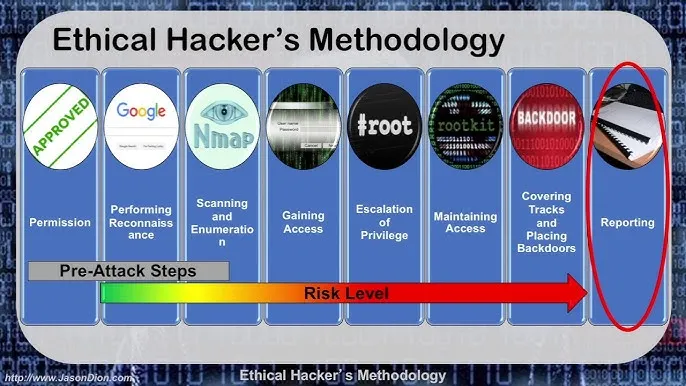

# Etik Hacker Metodolojisi (Sızma Testi Adımları)

*[Dion Training Youtube](https://www.youtube.com/watch?v=0Uc0oXPOmXM)*

1. **Permission** → **İzin / Yetkilendirme**
2. **Performing Recon.** → **Keşif Yapma**
3. **Scanning and Enumeration** → **Tarama ve Bilgi Toplama**
4. **Gaining Access** → **Erişim Sağlama**
5. **Escalation of Privilege** → **Yetki Yükseltme**
6. **Maintaining Access** → **Erişimi Sürdürme**
7. **Covering Tracks and Placing Backdoors** → **İzleri Gizleme ve Arka Kapı Yerleştirme**
8. **Reporting** → **Raporlama**

- **Pre-Attack Steps** → **Saldırı Öncesi Adımlar**
- **Risk Level** → **Risk Seviyesi**
---
## 1. Reconnaissance (Keşif)

Bu aşama, hedef hakkında mümkün olan en geniş kapsamlı bilgiyi toplamaya odaklanır. Bilgi toplama süreci çoğunlukla pasiftir; amaç, hedefin internette bıraktığı izleri, dijital mimarisini ve genel profilini anlamaktır.

Bu fazda değerlendirilir:

- Hedefin alan adları, alt alan adları ve IP blokları
- DNS yapılandırması, yönlendirmeler, e-posta kayıtları
- Kullanılan teknolojiler, kamuya açık servisler ve uygulama yığınları
- Organizasyonun çalışanları, teknoloji tercihi, üçüncü parti hizmet sağlayıcıları
- Açık kaynak istihbaratıyla (OSINT) elde edilebilecek tüm kamuya açık bilgiler

Bu süreç sonunda hedef ortamın “dış görünümü” oluşturulur. Diğer fazların tamamı, bu aşamada toplanan bilginin doğruluğuna dayanır.

---

## 2. Enumeration / Scanning (**Tarama ve Bilgi Toplama**)

Bu aşama hedef sistemlerle etkileşimin başladığı noktadır. Temel hedef, sistemlerin hangi servisleri sunduğunu, hangi sürümlerin çalıştığını ve saldırı yüzeyinin nasıl şekillendiğini anlamaktır.

Bu fazda analiz edilir:

- Hedef makinelerdeki açık portlar ve bu portlarda çalışan servisler
- Servislerin sürüm bilgileri ve yapılandırma detayları
- Kullanıcı hesapları, paylaşımlar veya servislerin verdiği ek bilgiler
- Ağ topolojisi, erişilebilir segmentler, varsa filtreleme veya güvenlik duvarı davranışları

Bu aşama, hedef ortamın iç yapısının görünür hale geldiği aşamadır ve sonraki fazda değerlendirilecek zafiyetlerin mantıksal temelini oluşturur.

---

## 3. Gaining Access (Erişim Sağlama)

Bu aşama, teorik olarak belirlenen zafiyetlerin gerçek dünyada risk oluşturup oluşturmadığının değerlendirildiği seviyedir. Amaç, bir açığın sistemde yetkisiz erişime yol açıp açamayacağının anlaşılmasıdır.

Değerlendirme şu mantık üzerine kuruludur:

- Her zafiyetin belirli bir koşul seti vardır; bu koşulların sağlanıp sağlanmadığı gözden geçirilir.
- Servislerin çalışma düzeni, erişim kontrolleri ve yapılandırma hataları analiz edilir.
- Hedef sistemin davranışı ile zafiyetin teorik açıklaması karşılaştırılır.
- Bir sistemde kontrol elde edilip edilemeyeceği, teknik detaylara girmeden mantıksal bir akışla değerlendirilir.

Bu aşamanın kilit noktası: sadece zafiyetin gerçek bir risk oluşturacak nitelikte olup olmadığı ortaya konur; sistemlere zarar verecek veya yetkisiz etki yaratacak işlemler yapılmaz.

---

## 4. Privilege Escalation (**Yetki Yükseltme**)

Bir sistemde kısıtlı erişim sağlandığında, o erişimin daha yüksek yetkilere çıkıp çıkamayacağı değerlendirilir. Analiz edilen konular:

- Sistemin güvenlik politikaları ve erişim kontrol modelleri
- Yanlış yapılandırılmış izin setleri
- Ayrıcalıklı servislerin davranışı
- Kullanıcı hataları veya zayıf güvenlik uygulamaları
- İşletim sistemi mekanizmalarının sağladığı mantıksal yükseltme yolları

Bu aşama saldırgan perspektifinin en kritik noktalarından biridir çünkü düşük yetkili bir erişim bile hatalı bir yapılandırmayla tüm sisteme yayılabilir. Ders kapsamında amaç, bu sürecin teknik açıdan nasıl değerlendirildiğini açıklamaktır.

---

## 5. Covering Tracks (İzleri Gizleme)

Bu faz, saldırı sonrası izlerin nasıl potansiyel olarak gizlenebileceği üzerine kavramsal bir değerlendirmedir. Etik testlerde bu fazın uygulanması yerine, **saldırganların hedeflerini nasıl gerçekleştirdiğini anlamak ve buna karşı savunma geliştirmek** amaçlanır.

Kavramsal olarak şu noktalar ele alınır:

- İz bırakmanın yöntemsel olarak nasıl gerçekleştiği
- Günlük kayıtlarının (log) güvenlikteki kritik önemi
- İzlerin silinmesi veya değiştirilmesinin sistem bütünlüğüne etkileri
- Güvenlik olay yönetimi (SIEM) gibi savunma sistemlerinin neden hayati olduğu
- Saldırgan davranışlarının izlenebilir hale getirilmesi için kullanılan koruma mekanizmaları

Bu faz, savunma ekiplerinin saldırı zincirini anlama ve tespit etme yetkinliğini güçlendirmeyi amaçlar.

---

## 6. Reporting (Raporlama)

Metodolojinin en önemli noktası, teknik çalışmanın kuruma değer sağlayacak bir çıktıya dönüştürülmesidir. Profesyonel bir rapor:

- Bulguları açık, doğrulanabilir ve teknik kanıtlarla desteklenmiş şekilde özetler
- Bulgunun olası etkisini, iş birimlerinin anlayabileceği şekilde sınıflandırır
- Riskin gerçek bağlamdaki önemini ortaya koyar
- Düzeltici/iyileştirici adımlar için net ve uygulanabilir öneriler sunar
- Testin kapsamı, yöntemleri ve kısıtlarını dokümante eder

Raporlama aşaması, teknik bulguların yönetime ve operasyon ekiplerine anlaşılır, uygulanabilir bir çerçevede aktarılmasını sağlar. Etik bir pentestin başarısı, büyük ölçüde raporun doğruluğu, tutarlılığı ve kurum için oluşturduğu katma değerle ölçülür.

# Kaynaklar

- https://www.geeksforgeeks.org/ethical-hacking/methodology-followed-by-the-hackers/
- https://tryhackme.com/room/hackermethodology
- https://www.udemy.com/course/the-complete-ethical-hacking-course