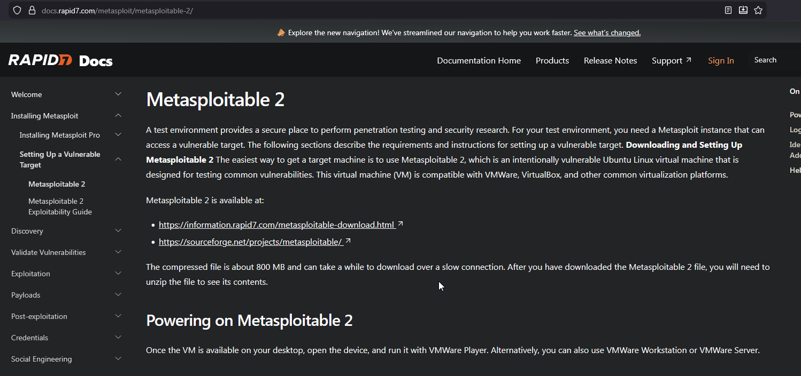
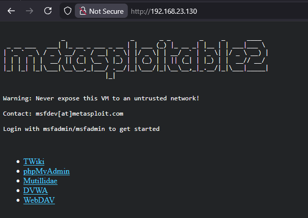

# 05.02. Zafiyetli Makine Kurulumu

## Metasploitable 2 Kurulum

Sızma testi(Pentest) yapabileceğimiz, zafiyet bulunun bir hedef makine oluşturmak için zafiyetler oluşturulmuş Ubuntu tabanlı Metasploitable 2’yi sanal makine olarak bilgisayarımıza kuracağız.

Aşağıdaki adresten indirme linklerini bulabilirsiniz:

- [https://docs.rapid7.com/metasploit/metasploitable-2/](https://docs.rapid7.com/metasploit/metasploitable-2/)
- [https://sourceforge.net/projects/metasploitable/](https://sourceforge.net/projects/metasploitable/)

İndirilen dosya zip’ten çıkardıktan sonra VMWavre Workstation’da açmak için “Open a Virtual Machine” seçeneğine tıklayarak “vmx” uzantılı dosya seçilir. Ya da doğrudan “vmx” uzantılı dosyaya çift tıklayarak açabilirsiniz.

### Kurulumdan Sonra Yapılacaklar

1. Makineyi başlat.
2. Varsayılan kullanıcı adı ve şifre ile giriş yap. (Kullanıcı adı ve şifreyi girerken, klavyeyi otomatik olarak İngilzce seçtiği için “i” yerine “ı” harfine basmalısınız.)
   1. Kullanıcı adı: `msfadmin`
   2. Şifre: `msfadmin`
3. Hangi dizinde olduğunuzu, dizin içinde olduğunuzu görmek için gerekli komutları yaz ve çalıştır.
4. Son olarak `ifconfig` ile ip adresini öğren.
5. Eğer VMWare Workstation kullanıyorsanız, `Ctrl+Alt` ile kontrolü kendi bilgisayarınıza alabilirsiniz.

### Metasploitable Web Arayüzüne Bağlanmak

Aynı ağa bağlı olduğumuz Kali Linux ya da Windows cihazınızdan ip adresini öğrendiğimiz **Metasploitable** web arayüzüne bağlanabiliriz.

Metasploitable bir çok servis barındırmakta ve bir server gibi çalışmakta, bu da hackleyebileceğimiz bir çok servis olduğu anlamına gelmektedir. Metasploitable 2 bu amaçla kullanılan bir zafiyetli makinedir.

## Kaynaklar

- https://www.youtube.com/watch?v=o3Lcha65fsM
- https://www.beyaz.net/tr/guvenlik/makaleler/metasploitable_2_nedir.html
- https://www.packtpub.com/en-us/learning/how-to-tutorials/getting-started-metasploitable2-and-kali-linux?srsltid=AfmBOoo9_cvQ6Nc54UJlL5SN2Uqey_-LKSqYu0N3E68iBg7fis6-SOdf
- https://docs.rapid7.com/metasploit/metasploitable-2-exploitability-guide/