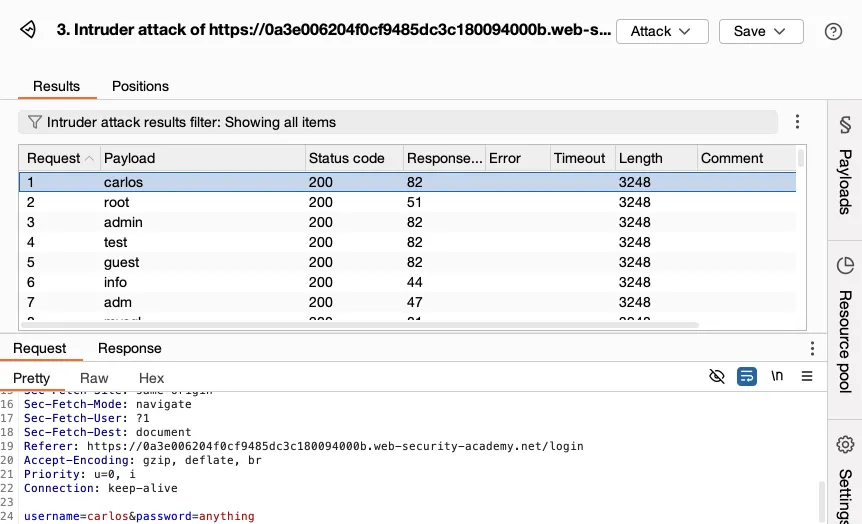

# 06.02. Web Pentest Araçları Tanıtımı

Created time: December 6, 2025 12:50 PM
Multi-select: 06-Web Güvenliği

# Web Pentest Araçları Tanıtımı

## 1. Giriş: Web Pentest Araçlarının Amacı

Web uygulamalarının güvenlik değerlendirmesi; istek–yanıt akışının analiz edilmesi, zayıf konfigürasyonların tespiti, gizli kaynakların bulunması ve bilinen zafiyetlerin tanımlanması gibi işlemler içerir. Bu süreçte kullanılan araçlar, testin verimliliğini ve kapsamını artırır. Bu derste sektörde en çok kullanılan dört temel araç ailesi incelenmektedir:

1. Burp Suite (Proxy, Repeater, Intruder)
2. OWASP ZAP
3. Gobuster / Dirbuster
4. Nikto

---

# 2. Burp Suite

Burp Suite, web uygulamalarında manuel ve yarı otomatik güvenlik testleri yapmak için kullanılan profesyonel bir platformdur. Test uzmanı ile tarayıcı arasına yerleşen bir *intercepting proxy* mantığıyla çalışır.



[https://portswigger.net/burp/documentation/desktop/images/getting-started/getting-started-with-intruder-6-selected-entry-request .png](./imgs/https://portswigger.net/burp/documentation/desktop/images/getting-started/getting-started-with-intruder-6-selected-entry-request.png)


[https://www.vaadata.com/blog/wp-content/uploads/2019/08/Introduction-to-Burp-Suite.jpg](https://www.vaadata.com/blog/wp-content/uploads/2019/08/Introduction-to-Burp-Suite.jpg)

## 2.1 Burp Proxy

### Amaç

Tarayıcıdan çıkan HTTP/S isteklerini durdurup incelemek ve gerektiğinde manipüle etmek.

### Kullanım Alanları

- Parametre manipülasyonu
- Cookie ve header testleri
- Auth bypass denemeleri
- HTTPS trafiğinin decrypt edilmesi

### Örnek İş Akışı

1. Tarayıcı Burp’e bağlanır (127.0.0.1:8080 proxy ayarı).
2. Kullanıcı bir butona tıklar.
3. İstek Burp’te durur ve değiştirilebilir.
4. Sunucuya gönderilir, yanıt analiz edilir.

---

## 2.2 Burp Repeater

### Amaç

Tek bir isteği defalarca farklı parametrelerle test etmek.

### Kullanım Alanları

- SQL Injection payload denemeleri
- XSS filtre bypass testleri
- Oturum yönetimi testleri
- Edge-case davranış analizi

Repeater, manuel kontrol gerektiren derinlemesine testlerde en kritik bileşenlerden biridir.

---

## 2.3 Burp Intruder

### Amaç

Belirli parametrelere otomatik ve sistematik payload enjeksiyonu yapmak.

### Kullanım Alanları

- Login brute-force
- IDOR (Insecure Direct Object Reference) testleri
- Fuzzing
- Parametre keşfi

### Temel Çalışma

1. Pozisyonlar (payload alanları) belirlenir.
2. Payload setleri seçilir.
3. Saldırı türü (Sniper, Cluster Bomb vb.) ayarlanır.
4. Otomatik test başlatılır.

---

# 3. OWASP ZAP (Zed Attack Proxy)

Açık kaynak kodlu, ücretsiz ve Burp Suite’e alternatif olarak kullanılan güçlü bir web güvenlik test aracıdır.


[https://devopedia.org/images/article/72/2450.1523863706.jpg](https://devopedia.org/images/article/72/2450.1523863706.jpg?utm_source=chatgpt.com)


[https://www.zaproxy.org/getting-started/images/zap-qstart-autoscan .png](./imgs/https://www.zaproxy.org/getting-started/images/zap-qstart-autoscan.png)

## 3.1 Genel Özellikler

- Proxy tabanlı trafik yakalama
- Pasif tarama (riskli davranışların gözlemi)
- Aktif tarama (otomatik saldırı simülasyonu)
- Spider (site gezgini)
- Ajax spider (JavaScript ağırlıklı siteler için)
- Raporlama modülleri

## 3.2 Avantajları

- Tamamen ücretsizdir.
- Öğrenmesi Burp’e kıyasla daha kolaydır.
- CI/CD süreçlerinde otomatik güvenlik taraması için uygundur.

## 3.3 Kullanım Senaryosu

- Uygulamanın tamamı ZAP üzerinden gezilir.
- ZAP pasif olarak tüm trafik üzerinde tarama yapar.
- Gerektiğinde aktif tarama başlatılır.

---

# 4. Gizli Dizin ve Dosya Keşfi: Gobuster / Dirbuster

Web sunucularında listeleme kapalı olsa bile, mevcut dizinler ve dosyalar brute-force yöntemiyle tespit edilebilir. Bu araçlar, *wordlist* kullanarak URL’leri test eder.


[https://securiumsolutions.com/wp-content/uploads/2023/03/brute-force-10-min .png](./imgs/https://securiumsolutions.com/wp-content/uploads/2023/03/brute-force-10-min.png)


[https://www.kali.org/tools/dirbuster/images/dirbuster .png](./imgs/https://www.kali.org/tools/dirbuster/images/dirbuster.png?utm_source=chatgpt.com)

---

## 4.1 Gobuster

Komut satırı tabanlı, hızlı ve hafif bir directory brute-force aracıdır.

### Kullanım Senaryoları

- /admin, /backup, /test gibi gizli yolları keşfetme
- Yedek dosyalar (.bak, .old) bulma
- Sızma testlerinde ilk yüzey keşfi (surface mapping)

### Örnek Komut

```
gobuster dir -u http://target/ -w /usr/share/wordlists/dirb/common.txt
```

---

## 4.2 Dirbuster

GUI tabanlıdır ve uzun soluklu testler için tercih edilir.

### Avantajları

- Eşzamanlı thread ayarı
- Wordlist seçimi kolay
- Test sürecini görsel olarak takip etme imkanı

---

# 5. Nikto – Temel Web Sunucu Zafiyet Tarayıcısı

Nikto, web sunucuları üzerinde hızlı bir ilk değerlendirme yapmak amacıyla kullanılan açık kaynaklı bir zafiyet tarayıcısıdır.


[https://i.ytimg.com/vi/GH9qn_DBzCk/maxresdefault.jpg](https://i.ytimg.com/vi/GH9qn_DBzCk/maxresdefault.jpg)


[https://upload.wikimedia.org/wikipedia/commons/c/c2/Nikto2 .png](./imgs/https://upload.wikimedia.org/wikipedia/commons/c/c2/Nikto2.png)

## 5.1 Nikto’nun Tespit Ettiği Unsurlar

- Eski veya bilinen zafiyetli sunucu sürümleri
- Varsayılan dosyalar ve dizinler
- Tehlikeli HTTP metotları (PUT, DELETE vb.)
- Yanlış yapılandırmalar (Directory Indexing, SSL sorunları)

## 5.2 Kullanım Amacı

Derinlemesine pentest gerçekleştirmeden önce bir ön bilgi elde etmek için kullanılır. Nikto yüzeysel bir araçtır; ancak hızlı bir risk görünürlüğü sağlar.

### Örnek Komut

```
nikto -h http://target.com
```

---

# 6. Araçların Web Pentest Sürecindeki Yeri

Araçların her biri pentest sürecinin farklı aşamalarına hizmet eder:

| Aşama | Araç | Amaç |
| --- | --- | --- |
| Keşif / Surface Mapping | Gobuster, Dirbuster | Gizli dizin ve dosya keşfi |
| İlk Zafiyet Analizi | Nikto | Temel sunucu hatalarının bulunması |
| Manuel Test | Burp Proxy, Repeater | İstek–yanıt analizi, zafiyet doğrulama |
| Otomatik Fuzzing / Brute Force | Burp Intruder | Parametre testleri, brute force |
| Otomatik Web Tarama | OWASP ZAP | Pasif ve aktif tarama |

---

# 7. Sonuç

Bu derste web pentestlerinde en çok kullanılan araçların temel mimarileri, kullanım amaçları ve senaryo bazlı rollerini inceledik. Bu araçlar birlikte kullanıldığında, hem manuel hem de otomatik test süreçlerini kapsayan güçlü bir pentest ortamı sağlar.